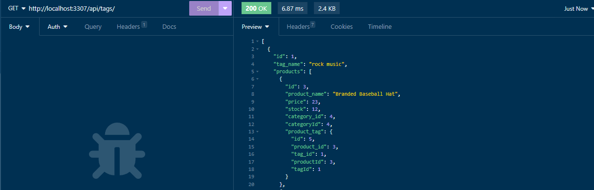
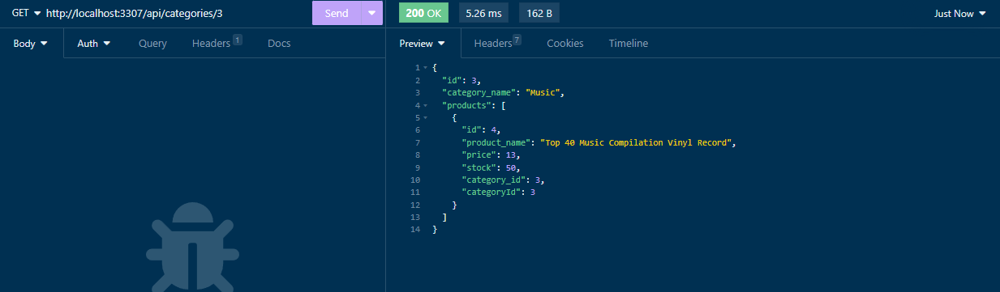

# E-Commerce Backend Project

## Description

This is an ExpressJS application that connects to a MySQL backend database using the Sequelize module from Node.JS. Given the starter code for the primary Express routes, this servces as a medium to showcase a deeper understand of briding the connection from web server to database backend.

## Table of Contents (Optional)

If your README is long, add a table of contents to make it easy for users to find what they need.

- [Installation](#installation)
- [Usage](#usage)
- [Credits](#credits)
- [License](#license)

## Installation

Download the repo and run the following commands:

```
// To install necessary modules
npm i

// To start the Express Web Server
node server.js
```

## Usage

Start the web server with the command:

```
node server.js
```

Express is configured to run on localhost:3307.
Using your favorite REST client application (e.g. Postman, Insomnia, etc.)
you can test by sending GET, POST, PUT, and DELETE requests to the following URLs:

http://localhost:3307/api/categories/\<idNumber>

http://localhost:3307/api/products/\<idNumber>

http://localhost:3307/api/tags/\<idNumber>

NOTE:

- POSTS require a JSON body
- GETs work with or witout the idNumber defined.
- PUTs require a JSON body as well as the idNumber of the item you will be modifying
- DELETEs require the idNumber of the item you are trying to delete

Demonstrates making a general query returning all tags:



Demonstration of making a target query, requesting a category by ID



Full Video of Demonstration Can be found at:
https://drive.google.com/file/d/1UloTqRZh6RRQyVhB6wwx2aEJuVb-m2GQ/view

## Credits

- Sequelize API reference https://sequelize.org/api/v6/identifiers
- Starter code provided by EdX

## License

The MIT License (MIT)

Copyright (c) 2015 Chris Kibble

Permission is hereby granted, free of charge, to any person obtaining a copy of this software and associated documentation files (the "Software"), to deal in the Software without restriction, including without limitation the rights to use, copy, modify, merge, publish, distribute, sublicense, and/or sell copies of the Software, and to permit persons to whom the Software is furnished to do so, subject to the following conditions:

The above copyright notice and this permission notice shall be included in all copies or substantial portions of the Software.

## THE SOFTWARE IS PROVIDED "AS IS", WITHOUT WARRANTY OF ANY KIND, EXPRESS OR IMPLIED, INCLUDING BUT NOT LIMITED TO THE WARRANTIES OF MERCHANTABILITY, FITNESS FOR A PARTICULAR PURPOSE AND NONINFRINGEMENT. IN NO EVENT SHALL THE AUTHORS OR COPYRIGHT HOLDERS BE LIABLE FOR ANY CLAIM, DAMAGES OR OTHER LIABILITY, WHETHER IN AN ACTION OF CONTRACT, TORT OR OTHERWISE, ARISING FROM, OUT OF OR IN CONNECTION WITH THE SOFTWARE OR THE USE OR OTHER DEALINGS IN THE SOFTWARE.

## Badges


